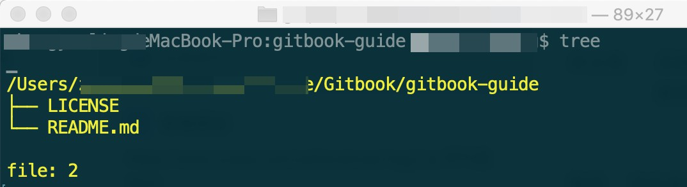
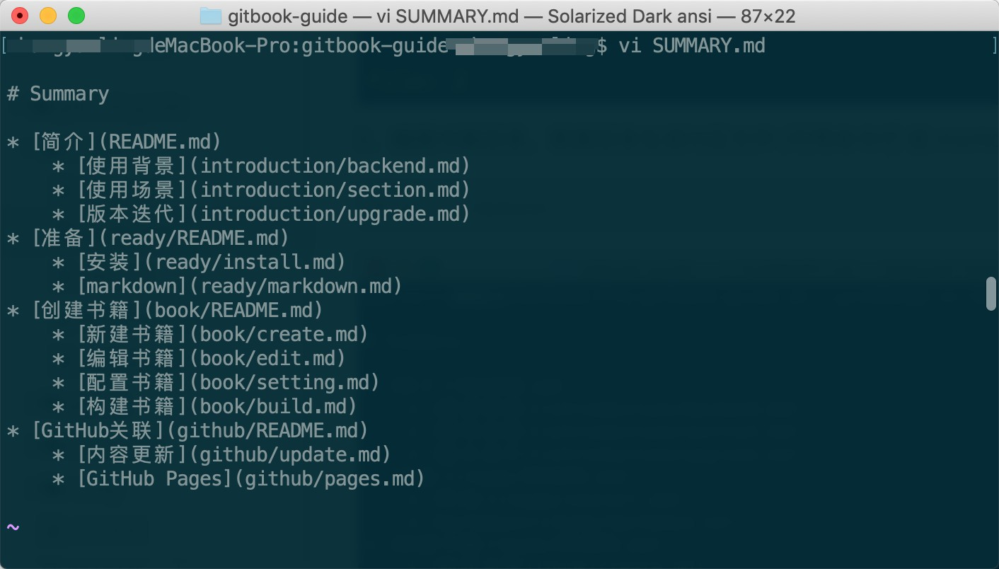

# 新建书籍

\[TOC\]

## 一、原理概述

处理过程：先创建书籍目录，然后根据目录生成书籍文件结构。 主要指令： `gitbook init`

## 二、实现过程

### 1. 创建文件夹  mybook

```text
$ mkdir mybook
```

### 2. _gitbook init_ 初始化书籍  生成书籍信息

​ \|_\_\__ README.md 书籍介绍

​ \|_\_\__ SUMMARY.md 书籍目录

```text
$ cd ~/mybook  
$ gitbook init
```



### 3.  编辑_SUMMARY.md_ 添加书籍目录  \(可用命令行 或 markdown编辑器\)

```text
$ vi  ～/mybook
```



​

### 4. _gitbook init_ 根据书籍目录生成对应文件

```text
$ gitbook init
```


查看目录 tree \(可通过 npm 安装依赖 [tree-cli](https://www.npmjs.com/package/tree-cli) \)

```text
$ tree
```


