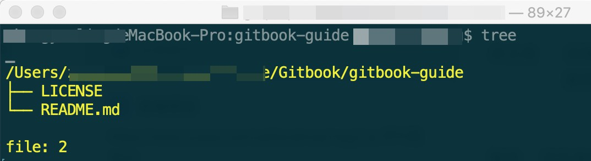
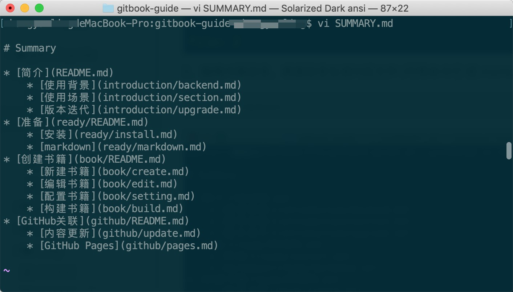

# 新建书籍

[TOC]

##  一、原理概述

处理过程：先创建书籍目录，然后根据目录生成书籍文件结构。 
主要指令： `gitbook init`


## 二、实现过程

###1. 创建文件夹  mybook    

     ```
$ mkdir mybook
     ```


###2. *gitbook init* 初始化书籍  生成书籍信息
​	|____ README.md   书籍介绍

​	|____ SUMMARY.md  书籍目录

```
$ cd ~/mybook  
$ gitbook init 
```

      

###3.  编辑*SUMMARY.md* 添加书籍目录  (可用命令行 或 markdown编辑器)

```
$ vi  ～/mybook
```



​		

###4. *gitbook init* 根据书籍目录生成对应文件

```
$ gitbook init
```


查看目录 tree (可通过 npm 安装依赖 [tree-cli](https://www.npmjs.com/package/tree-cli) )

```
$ tree
```

