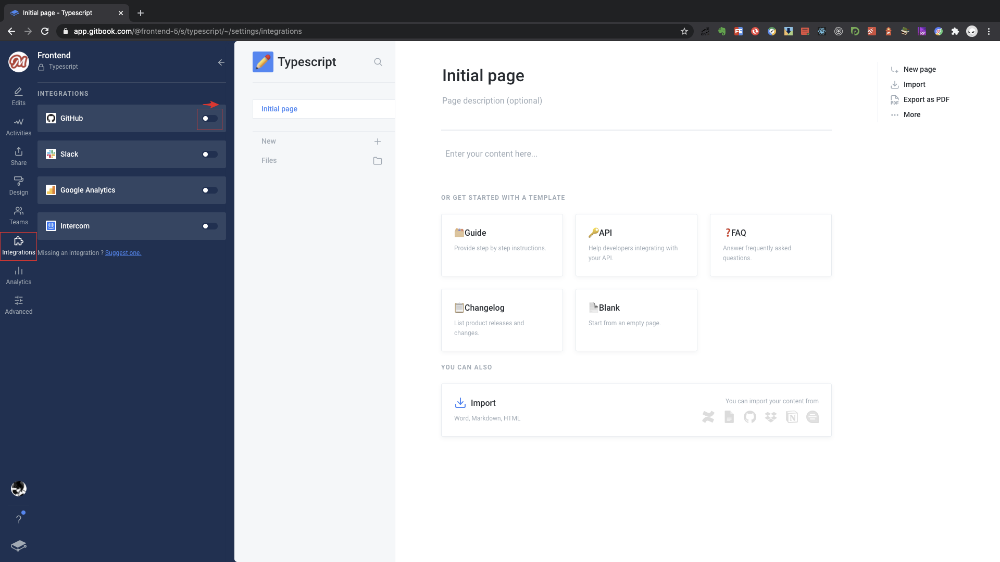

# GitHub Pages

## 关联Github  repository

进入新建空间，找到左侧栏 integrations 点击，打开Github 选项进行关联 目标organization和repository




```
$ give me super-powers
```


 Super-powers are granted randomly so please submit an issue if you're not happy with yours.


Once you're strong enough, save the world:


```bash
# Ain't no code for that yet, sorry
echo 'You got to trust me on this, I saved the world'
```



